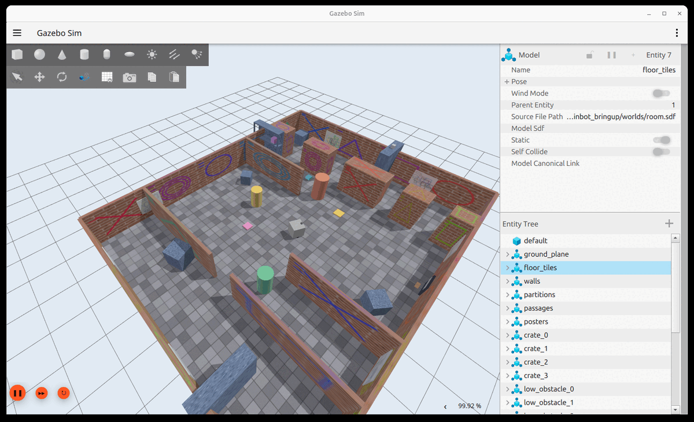
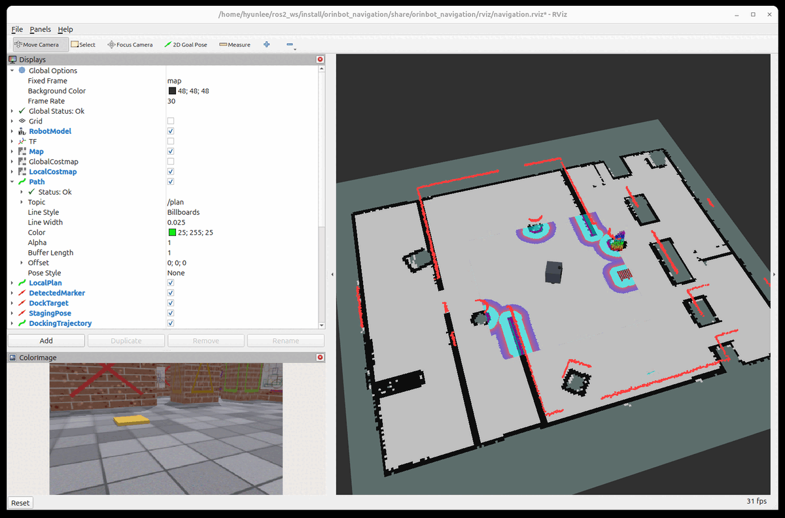

# orinbot — ROS 2 Jazzy + Gazebo Harmonic 시뮬레이션 워크스페이스

시뮬레이션 환경에서 로봇 제어 및 자율주행 스택을 개발하되, 실물 로봇 배포 시 시뮬레이션과 실물 로봇이 **동일한 인터페이스**를 갖도록 구성한 ROS 2 워크스페이스입니다.

배포 타깃은 **Jetson Orin Nano Super**(6코어 A78AE + 8GB 통합 메모리)입니다.

```bash
ros2 launch orinbot_navigation navigation.launch.py
```



*`room.sdf` (10 × 8 m) — 벽마다 고유 텍스처를 입혀 시각 오도메트리의 특징점을 만듭니다. 칸막이와 통로, 높이가 다른 선반 3종, 낮은 장애물이 배치되어 있습니다.*



*프론티어 자동 탐사로 방 전체를 매핑한 직후 (206초 완주). 검은색은 점유 격자, 빨간색은 라이다 스캔, 청록·보라색은 로컬 코스트맵 팽창 영역이며 왼쪽 아래는 VSLAM 입력 컬러 영상입니다.*

## 목차

- [문서](#문서)
- [로봇 사양](#로봇-사양)
- [패키지 구성](#패키지-구성)
- [설치](#설치) · [빌드](#빌드)
- **[실행 구성 3가지](#실행-구성-3가지)** — PC 단독 / 분산(PC+Orin) / 실기 단독
- [실행](#실행) — 시뮬레이터 단독, 월드, 조종, 예제
  - [시뮬레이션 실행](#시뮬레이션-실행)
  - [제공 월드](#제공-월드)
  - [모델 확인 및 키보드 원격 조종](#모델-확인-및-키보드-원격-조종)
  - [예제 노드](#예제-노드)
- [인터페이스](#인터페이스) — 토픽·액션 목록, [TF 구조](#tf-구조)
- [실물 로봇 전환 가이드](#실물-로봇-전환-가이드)
- **[자율주행 (VSLAM + Nav2)](#자율주행-vslam--nav2)** — **주 진입점**
  - [실행 옵션](#실행-옵션)
  - [주요 실행 인자](#주요-실행-인자)
  - [런타임 필수 점검](#런타임-필수-점검)
- [시스템 핵심 구성 및 사양](#시스템-핵심-구성-및-사양)
  - [위치 추정 및 코스트맵](#위치-추정-및-코스트맵)
  - [경로 계획 및 제어 설정](#경로-계획-및-제어-설정)
  - [충전 도킹](#충전-도킹-opennav_docking)

## 문서

| 문서 | 내용 |
|---|---|
| `README.md` (이 문서) | 설치, 실행, 인터페이스, 현재 구성 |
| **`docs/ros2-lessons.md`** | **이 프로젝트에서 겪은 설계급 문제들** — 왜 문제였고 왜 그 해결법이 통했는지 |
| `tools/README.md` | 성능 측정 도구와 기준선 수치 |
| `CLAUDE.md` | 작업 지침 (지켜야 할 규칙과 현재 설정값) |

> **개발자 노트 (`docs/ros2-lessons.md`를 정리하며)**
>
> ROS 2와 자율주행 기술을 공부하고 탐구하시는 분들을 위해, 이 프로젝트를 진행하며 느낀 저의 생각과 의견에 대해 [`docs/ros2-lessons.md`](docs/ros2-lessons.md)에 기록해 두었습니다. 저의 경험과 고민의 흔적들이 여러분만의 로봇을 만들어가는 여정에 조금이나마 작은 도움이자 인사이트가 되기를 기대합니다.
## 로봇 사양

- **구동 방식**: 차동 구동(Differential Drive) 방식, 중앙 구동 바퀴 2개
- **캐스터**: 4개 (전방 2개, 후방 2개) — 마찰이 없는 구체(Sphere)로 모델링
- **섀시 외형**: 0.40 m 정육면체 (외접 반지름 **0.283 m**)
- **비전 센서**: Intel RealSense D435i (전면, 15° 하향 피치) — RGB + Depth + IMU
- **라이다**: RPLIDAR A2M12 (상단) — 360° 스캔 (지면 기준 스캔 평면 높이 0.49 m)

로봇 기본 치수는 `orinbot_description/urdf/orinbot.urdf.xacro` 상단 파라미터 블록에 정의되어 있습니다.
실물 로봇 치수 변경 시 해당 블록과 `orinbot_bringup/config/controllers.yaml`의 `wheel_separation`, `wheel_radius` 항목을 함께 수정해야 합니다.

## 패키지 구성

| 패키지 | 역할 |
|---|---|
| `orinbot_description` | URDF/xacro 모델링, RViz 설정 및 URDF 검증용 런치 파일 |
| `orinbot_bringup` | Gazebo 월드, 컨트롤러/브리지/EKF 설정 및 시뮬레이션 통합 런치 파일 |
| `orinbot_examples_py` | rclpy 기반 예제 노드 (`square_driver`) |
| `orinbot_examples_cpp` | rclcpp 기반 예제 노드 (`depth_safety_filter`) |
| `orinbot_navigation` | RTAB-Map VSLAM + Nav2 자율주행 + 프론티어 자동 탐사 |
| `tools/` | 성능 측정 및 회귀 테스트 스크립트 모음 (`tools/README.md` 참고) |

## 설치

```bash
sudo apt update && sudo apt install -y \
  ros-jazzy-ros-gz \
  ros-jazzy-ros2-control ros-jazzy-ros2-controllers ros-jazzy-gz-ros2-control \
  ros-jazzy-xacro ros-jazzy-joint-state-publisher-gui \
  ros-jazzy-realsense2-description \
  ros-jazzy-depth-image-proc \
  ros-jazzy-rtabmap-ros ros-jazzy-navigation2 ros-jazzy-nav2-bringup \
  ros-jazzy-spatio-temporal-voxel-layer \
  ros-jazzy-twist-mux \
  ros-jazzy-robot-localization \
  python3-numpy python3-scipy
```

`rosdep install --from-paths src -y --ignore-src` 명령으로 의존성을 설치할 수도 있습니다.

### 필수 런타임 패키지

| 패키지 | 미설치 시 현상 |
|---|---|
| `spatio-temporal-voxel-layer` | 코스트맵 3D 장애물 인식 불가 (플러그인 로드 실패) |
| `twist-mux` | `/cmd_vel` 토픽 미발행으로 로봇 정지 |
| `robot-localization` | EKF 노드 미실행으로 `odom -> base_footprint` TF 단절 |

### 필수 환경변수 설정

```bash
export ROS_AUTOMATIC_DISCOVERY_RANGE=LOCALHOST
```

여러 네트워크 인터페이스가 활성화되어 있을 경우, FastDDS 멀티캐스트 디스커버리로 인해 Nav2 라이프사이클 상태 전이 서비스 응답이 지연되거나 중단될 수 있습니다. 디스커버리 범위를 `LOCALHOST`로 제한하여 이를 예방합니다.

> ROS 2 Jazzy는 Gazebo Harmonic을 `ros-jazzy-gz-*-vendor` 패키지로 기본 제공하므로, osrfoundation 저장소를 별도로 추가할 필요가 없습니다.

## 빌드

```bash
cd ~/ros2_ws
source /opt/ros/jazzy/setup.bash
colcon build --symlink-install
source install/setup.bash
```

## 실행 구성 3가지

같은 코드를 세 가지 배치로 실행할 수 있습니다. **무엇이 어느 기계에서 도는지**가 다릅니다.

| | 구성 | Gazebo | RViz | 주 연산 | 상태 |
|---|---|---|---|---|---|
| **1** | PC 단독 | PC | PC | PC | 검증됨 |
| **2** | 분산 (PC + Orin) | PC | PC | **Orin** | 검증됨 |
| **3** | 실기 단독 | 없음 | 없음 | **로봇** | **준비 중** (아래 참고) |

---

### 구성 1 — PC 한 대에서 전부

가장 단순합니다. 개발과 회귀 시험의 기본 구성입니다.

```bash
source /opt/ros/jazzy/setup.bash && source install/setup.bash
export ROS_AUTOMATIC_DISCOVERY_RANGE=LOCALHOST

ros2 launch orinbot_navigation navigation.launch.py explore:=true
```

`navigation.launch.py`가 시뮬레이터·SLAM·Nav2·도킹·RViz를 순서대로 모두 띄웁니다.

---

### 구성 2 — 주 연산을 Orin이, 화면은 PC가

실기 배치에 한 걸음 가까운 구성입니다. **Orin이 VSLAM과 Nav2를 실제로 감당하는지** 확인할 때 씁니다.

```
개발 PC                          Orin
─────────────────                ──────────────────────────
Gazebo (물리 + 센서 렌더링)  ←→   카메라 전처리 (뎁스 → 포인트클라우드)
RViz (시각화)                     VSLAM (rgbd_odometry + rtabmap)
                                  Nav2 / 탐사 / 도킹
```

**① 두 기계의 디스커버리를 맞춥니다** — `ROS_DOMAIN_ID`가 같아야 하고, `ROS_AUTOMATIC_DISCOVERY_RANGE`는 **`LOCALHOST`가 아니어야** 합니다 (기본값 `SUBNET`).

```bash
# PC와 Orin 양쪽 모두
export ROS_DOMAIN_ID=0
unset ROS_AUTOMATIC_DISCOVERY_RANGE
```

**② PC — 시뮬레이터와 RViz만**

```bash
ros2 launch orinbot_bringup sim.launch.py use_rviz:=false use_pointcloud:=false
ros2 run rviz2 rviz2 -d src/orinbot_navigation/rviz/navigation.rviz \
  --ros-args -p use_sim_time:=true
```

> **`use_pointcloud:=false`가 중요합니다.** 포인트클라우드를 PC에서 만들어 보내면 송신이 **589 Mbps**까지 오르는데, Orin에서 만들면 **134 Mbps**로 떨어집니다(1 Gbps 링크 기준 59% → 13%). 뚱뚱한 포인트클라우드 대신 홀쭉한 뎁스 영상을 보내고 받는 쪽에서 부풀리는 것이고, **실기에서는 어차피 이 배치가 강제됩니다.**

**③ Orin — 카메라 전처리 + 주 연산**

`use_pointcloud:=false`로 끈 두 노드(`point_cloud_xyz`, `depth_register`)를 Orin에서 띄운 뒤, 시뮬레이터 없이 항법 스택만 올립니다.

```bash
ros2 launch orinbot_navigation navigation.launch.py \
  use_sim:=false use_rviz:=false explore:=true
```

**실측 성적** (`room.sdf`, 1 Gbps 유선):

| 항목 | 값 |
|---|---|
| Orin CPU | 3.2 / 6 코어 |
| 탐사 완주 | 138~170초 |
| SLAM 위치 오차 | 중앙값 5 mm |
| PC 송신 대역폭 | 134 Mbps |

> **탐사와 도킹을 동시에 켜지 마십시오.** 둘 다 켜면 Orin CPU가 4.9/6 코어까지 올라 `rtabmap`이 처리 예산(0.5초)을 거의 다 쓰고, 자세 추정이 무너져 지도가 깨집니다. 실제 운용에서도 둘은 동시에 필요하지 않으며, `auto_dock`의 절전 기능과 `dock_marker_board`의 `~/pause`가 이를 위해 준비되어 있습니다.

---

### 구성 3 — 실기 단독 (준비 중)

로봇 위에서 Gazebo와 RViz 없이 주 연산만 돌리는 구성입니다. **최종 배치 목표이지만 아직 그대로는 동작하지 않습니다.**

바꿔야 할 것:

| 항목 | 현재 | 실기에서 필요한 것 |
|---|---|---|
| **시계** | `use_sim_time: true`가 설정·런치에 **하드코딩** | 런치 인자로 빼고 `false`. 실기에는 `/clock`이 없어 지금 그대로면 노드들이 시계를 기다리며 멈춥니다 |
| 센서 | Gazebo 브리지 | `realsense2_camera` (`align_depth.enable:=true`), `rplidar_ros` |
| 구동 | `gz_ros2_control` | URDF `<hardware>` 블록을 실물 `hardware_interface` 플러그인으로 교체 |
| 배터리 | `battery_sim` (Gazebo 참값으로 접촉 판정) | 실물 BMS. 접촉 판정은 충전 전류로 |
| 안전 | 도크 앞 0.7 m는 코스트맵 충돌 검사 꺼짐 | **범퍼 스위치나 모터 전류 제한 등 소프트웨어 밖의 보호 수단** |

의도한 실행 형태:

```bash
# 센서·구동 드라이버 (별도 런치)
ros2 launch orinbot_bringup robot.launch.py          # 아직 없음

# 주 연산만 — 시뮬레이터도 RViz도 없이
ros2 launch orinbot_navigation navigation.launch.py \
  use_sim:=false use_rviz:=false use_sim_time:=false  # use_sim_time 인자 추가 필요
```

원격에서 화면을 보려면 **구성 2와 같은 방식**으로 다른 PC에서 RViz만 띄우면 됩니다 (`ROS_DOMAIN_ID` 일치, 디스커버리 범위 `SUBNET`).

실기 도킹 절차(마커 인쇄·부착, 카메라 내부 파라미터, 도크 좌표 등록, 보정값 재측정)는 [`docs/ros2-lessons.md`](docs/ros2-lessons.md)를 참고하십시오.

---

## 실행

이 절은 **시뮬레이터만** 띄우는 방법입니다 — 모델 확인, 월드 점검, 수동 조종용입니다.
자율주행까지 한 번에 실행하려면 [자율주행 (VSLAM + Nav2)](#자율주행-vslam--nav2) 절의
`navigation.launch.py`를 사용하십시오. 이 런치 파일이 아래 `sim.launch.py`를 포함하여 SLAM, Nav2, 도킹 노드까지
순서대로 실행합니다.

### 시뮬레이션 실행

```bash
ros2 launch orinbot_bringup sim.launch.py
```

주요 실행 인자:

| 인자 | 기본값 | 설명 |
|---|---|---|
| `world` | `room.sdf` | `orinbot_bringup/worlds/` 내 월드 파일 |
| `x` `y` `z` `yaw` | `0 0 0.15 0` | 로봇 초기 생성(스폰) 위치 및 방향 |
| `use_rviz` | `true` | RViz2 동시 실행 여부 |
| `gui` | `true` | `false` 설정 시 Gazebo GUI 없이 헤드리스(Headless) 실행 |
| `use_pointcloud` | `true` | `depth_image_proc` 기반 포인트 클라우드 생성 여부 |
| `clock_rate` | `100.0` | `/clock` 발행 주기 [Hz] (`0` 설정 시 Gazebo 원본 사용) |

> `clock_rate`는 ROS로 전달되는 `/clock` 발행 주기를 조정하여 rclpy 시계 콜백 부하를 관리합니다. 시뮬레이션 물리 스텝은 유지됩니다.

### 제공 월드

| 월드 | 크기 | 주요 테스트 목적 | 도크 존재 여부 |
|---|---|---|---|
| `room.sdf` (기본) | 10 × 8 m | 회귀 테스트 및 성능 기준선 측정 | 있음 |
| `maze.sdf` | 6 × 6 m | 좁은 통로(0.75 m) 주행 및 회차 성능 검증 | 없음 |
| `hall.sdf` | 24 × 18 m | 대규모 공간 주행 누적 오차 및 탐사 수렴 측정 | 있음 |
| `office.sdf` | 20 × 14 m | 복합 환경 (동적 장애물/보행자 3명 포함) | 있음 |

```bash
ros2 launch orinbot_navigation navigation.launch.py world:=office.sdf explore:=true
ros2 launch orinbot_navigation navigation.launch.py world:=maze.sdf dock:=false
```

월드 전환 시 RTAB-Map 포즈 그래프 병합 방지를 위해 데이터베이스 경로를 분리해야 합니다 (`database_path:=~/.ros/office.db`).

#### 텍스처 파일 생성

`maze.sdf` 및 `hall.sdf` 텍스처는 스크립트로 생성합니다.

```bash
python3 src/orinbot_bringup/models/room_materials/generate_textures.py maze hall
```

#### 사무실 월드 동적 보행자 시뮬레이션

`office.sdf` 내 보행자는 별도 스크립트로 제어합니다.

```bash
ros2 run orinbot_bringup people_sim.py --ros-args -p use_sim_time:=true
```

| 객체 | 이동 속도 | 동작 특성 |
|---|---|---|
| `person_0` | 1.20 m/s | 고속 보행 |
| `person_1` | 0.55 m/s | 저속 보행 (경로 끝 6초 정지) |
| `person_2` | 0.85 m/s | 표준 속도 보행 |

보행자는 로봇이 진행 방향 ±75° 이내 1.4 m 진입 시 정지하며, 1.8 m 이격 시 재개합니다. 12초 이상 대기 시 반대 방향으로 돌아서 이동합니다.

### 모델 확인 및 키보드 원격 조종

```bash
# URDF 모델 확인 (Gazebo 미사용)
ros2 launch orinbot_description display.launch.py

# 키보드 조종
ros2 run teleop_twist_keyboard teleop_twist_keyboard \
  --ros-args -p stamped:=true -p frame_id:=base_footprint
```

### 예제 노드

```bash
# 정사각형 주행 (Python)
ros2 run orinbot_examples_py square_driver --ros-args -p use_sim_time:=true

# 뎁스 기반 비상 정지 필터 (C++)
ros2 run orinbot_examples_cpp depth_safety_filter --ros-args -p use_sim_time:=true
```

## 인터페이스

| 토픽 | 타입 | 방향 | 비고 |
|---|---|---|---|
| `/cmd_vel` | `geometry_msgs/TwistStamped` | 입력 | `twist_mux` 최종 제어 출력 |
| `/cmd_vel_teleop` | `geometry_msgs/TwistStamped` | 입력 | 수동 조종 (최우선 순위) |
| `/odom` | `nav_msgs/Odometry` | 출력 | 휠 오도메트리 |
| `/odometry/filtered` | `nav_msgs/Odometry` | 출력 | EKF 융합 데이터 (휠 + IMU) |
| `/joint_states` | `sensor_msgs/JointState` | 출력 | 관절 상태 |
| `/scan` | `sensor_msgs/LaserScan` | 출력 | RPLIDAR 360° 스캔 |
| `/camera/color/image_raw` | `sensor_msgs/Image` | 출력 | VSLAM 특징점 추출용 RGB 영상 |
| `/camera/depth/image_rect_raw` | `sensor_msgs/Image` | 출력 | 보정 뎁스 영상 |
| `/camera/aligned_depth_to_color/image_raw` | `sensor_msgs/Image` | 출력 | RGB 프레임 정합 뎁스 영상 |
| `/camera/depth/points` | `sensor_msgs/PointCloud2` | 출력 | STVL 3D 장애물 관측 데이터 |
| `/camera/imu` | `sensor_msgs/Imu` | 출력 | IMU 데이터 (각속도 융합용) |
| `/map` | `nav_msgs/OccupancyGrid` | 출력 | RTAB-Map 점유 격자 (QoS: RELIABLE + TRANSIENT_LOCAL) |
| `/battery_state` | `sensor_msgs/BatteryState` | 출력 | 배터리 상태 (잔량/전압/전류) |
| `/detected_dock_pose` | `geometry_msgs/PoseStamped` | 출력 | 도크 비전 검출 자세 |
| `/cmd_vel_dock` | `geometry_msgs/TwistStamped` | 내부 | 도킹 속도 명령 (우선순위 50) |
| `/exploration_enabled` | `std_msgs/Bool` | 입력 | 프론티어 탐사 활성화 스위치 |
| `/ground_truth/odom` | `nav_msgs/Odometry` | 출력 | Gazebo 참값 자세 (시뮬레이션 전용) |

| 액션 | 타입 | 비고 |
|---|---|---|
| `/navigate_to_pose` | `nav2_msgs/NavigateToPose` | 목표 지점 이동 |
| `/dock_robot` | `nav2_msgs/DockRobot` | 충전 도크 접안 |
| `/undock_robot` | `nav2_msgs/UndockRobot` | 도크 이탈 |

`/map` 토픽 구독 시 QoS 설정은 **RELIABLE + TRANSIENT_LOCAL**로 지정해야 합니다.

### TF 구조

```
map --(rtabmap)--> vodom --(rgbd_odometry)--> odom --(EKF)--> base_footprint
                                                              -> base_link
                                                                 -> 바퀴/캐스터
                                                                 -> laser
                                                                 -> camera_*
```

## 실물 로봇 전환 가이드

`orinbot_description/urdf/orinbot.ros2_control.xacro` 내 `<hardware>` 블록을 사용자 커스텀 `hardware_interface` 플러그인으로 교체하면, 상위 제어 및 항법 스택(Nav2, 노드 등) 변경 없이 실물 로봇 환경으로 이식할 수 있습니다.

## 자율주행 (VSLAM + Nav2)

```bash
ros2 launch orinbot_navigation navigation.launch.py
```

### 실행 옵션

```bash
# 프론티어 자동 탐사 및 지도 생성
ros2 launch orinbot_navigation navigation.launch.py explore:=true

# 기존 지도 기반 위치 추정 전용 모드
ros2 launch orinbot_navigation navigation.launch.py localization:=true

# 헤드리스 실행 (GUI 미사용)
ros2 launch orinbot_navigation navigation.launch.py gui:=false use_rviz:=false

# SLAM + Nav2 단독 기동 (시뮬레이터가 이미 실행 중인 경우)
ros2 launch orinbot_navigation navigation.launch.py use_sim:=false

# 자동 탐사 노드 단독 추가
ros2 launch orinbot_navigation explore.launch.py

# 충전 도킹 명령어 테스트
ros2 action send_goal /dock_robot nav2_msgs/action/DockRobot "{use_dock_id: true, dock_id: home_dock}"
ros2 action send_goal /undock_robot nav2_msgs/action/UndockRobot "{}"
```

### 주요 실행 인자

| 인자 | 기본값 | 설명 |
|---|---|---|
| `world` | `room.sdf` | 월드 파일 선택 |
| `database_path` | `~/.ros/orinbot_rtabmap.db` | RTAB-Map DB 파일 경로 |
| `explore` | `false` | 자동 탐사 노드 기동 여부 |
| `localization` | `false` | 위치 추정 전용 모드 (지도 갱신 비활성화) |
| `use_sim` | `true` | Gazebo 시뮬레이터 동시 실행 여부 |
| `use_rviz` / `gui` | `true` | RViz / Gazebo GUI 표시 여부 |
| `use_vslam` | `true` | Visual Odometry 활성화 여부 |
| `detection_rate` | `2.0` | RTAB-Map 노드 추가 주기 [Hz] |
| `memory_thr` | `3000` | 작업 메모리 노드 제한 (0=무제한) |
| `map_3d` | `false` | 3D 점유 격자 생성 여부 |
| `reg_strategy` | `2` | 루프 클로저 검증 방식 (0=Vis, 2=Vis+ICP) |
| `dock` | `true` | 충전 도킹 스택 실행 여부 |
| `docking_mode` | `staged` | 도킹 방식 선택 (`staged` \| `smooth`) |
| `auto_dock` | `true` | 배터리 잔량 기반 자동 도킹 활성화 여부 |
| `clock_rate` | `100.0` | `/clock` 발행 주기 [Hz] |
| `battery_speedup` | `1.0` | 배터리 방전/충전 배속 |
| `initial_soc` | `0.85` | 초기 배터리 잔량 (0.0 ~ 1.0) |

### 런타임 필수 점검

시뮬레이션 기동 후 `/clock` 발행자 수 검증:

```bash
ros2 topic info /clock | grep Publisher
```

`Publisher count: 1` 상태여야 합니다. 2 이상일 경우 잔여 `parameter_bridge` 프로세스를 종료해야 합니다:

```bash
ps -eo pid,args | grep -E '/opt/ros/jazzy|ros2_ws/install|[g]z sim' \
  | grep -v shell-snapshots | awk -v me=$$ '$1 != me {print $1}' | xargs -r kill -9
ros2 daemon stop
```

## 시스템 핵심 구성 및 사양

### 위치 추정 및 코스트맵

- **Visual Odometry**: `rtabmap_odom/rgbd_odometry` (휠 오도메트리를 모션 예측 초기값으로 활용)
- **SLAM / Mapping**: `rtabmap_slam/rtabmap` (QoS: RELIABLE + TRANSIENT_LOCAL)
- **Obstacle Layer**: RPLIDAR `/scan` 2D 장애물 해제 (Ray clearing)
- **STVL Layer**: D435i `/camera/depth/points` 3D 복셀 시간 감쇠 소거 (`voxel_decay: 10.0`)
- **속도 명령 경로**: `controller_server` → `/cmd_vel_nav` → `velocity_smoother` → `/cmd_vel_smoothed` → `twist_mux` → `/cmd_vel`

### 경로 계획 및 제어 설정

- **전역 플래너**: `SmacPlanner2D` (`cost_travel_multiplier: 4.0`)
- **지역 제어기**: `MPPI` 제어기
  - `GoalCritic`: 0.5
  - `PathAlignCritic`: 0.25
  - `PathFollowCritic`: 0.3
- **최소 통과 가능 통로 폭**: 0.70 m (회차 시 제자리 회전 최소 외접 폭 0.566 m 기준 안전 여유 고려)

### 충전 도킹 (opennav_docking)

| 방식 | 제어 알고리즘 | 특징 |
|---|---|---|
| `staged` (기본) | `scripts/staged_dock.py` | 정지-측정-보정 단계 분리, 후진 접안 |
| `smooth` | Nav2 순정 `opennav_docking` | 마커 실시간 추종 곡선 제어 |

- **도크 검출**: ArUco `DICT_4X4_50` 마커 3장을 좌우 0.16 m 간격으로 벌려 하나의 보드로 자세 추정 (`dock_marker_board.py`)
- **후진 접안**: 마커를 마주 본 채 정렬을 끝내고 회전점(마커면 0.55 m)에서 180° 회전 후 후진합니다. 충전 중 카메라가 벽이 아니라 방을 향하므로 시각 오도메트리가 유지됩니다.
- **접촉 허용치**: 세로 ±48 mm / 가로 ±34 mm (포고핀 배열이 동판 위에 얹히는 범위)
- **충전 절전 모드**: 도킹 완료 후 인지 및 항법 노드를 일시 정지(Lifecycle PAUSE / RTAB-Map pause)하여 전력 소모 관리

```bash
# 도킹 파라미터 스윕 (여러 초기 조건을 동시에 시험)
python3 tools/dock_bench.py --jobs 4
```
